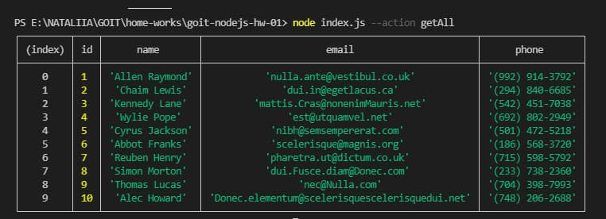
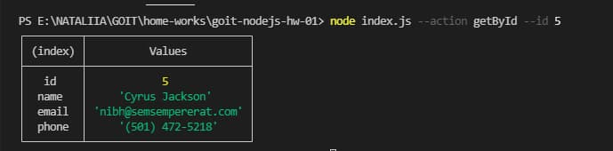
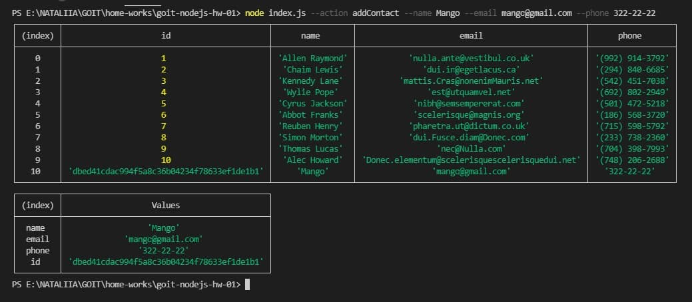
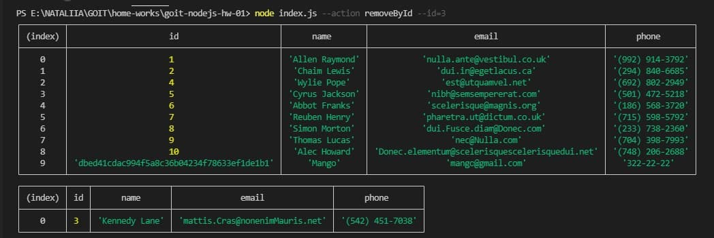

<h1 >GOIT-NODEJS-HW-01</h1>
 

<h2>Get and output the whole list of contacts in the form of a table (console.table)</h2>

 
 

<h2>Get contact with id</h2>

 
 

<h2>Add contact</h2>

  

<h2>Remove contact</h2>

